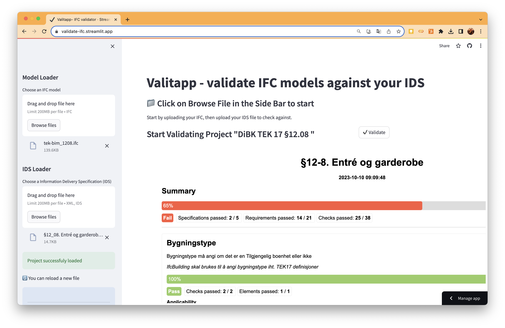

# TEK-IDS

Dette repoet er laget for å utvikle Information Delivery Specification (IDS), som dokumentert på [buildingSMART International sitt github repo her](https://github.com/buildingSMART/IDS/tree/development/Documentation) for å representere kravene i Teknisk forskrift. 

IDS er en buildingSMART standard format for å spesifisere informasjonskrav, spesielt egnet for å kunne validere bygningsmodeller automatisk og maskinlesbart slik illustrasjonen under beskriver. 

<p align="center">
  
</p>

Koden som genererer IDSene ligger i ```/notebooks```, filene i ```/ids``` og testmodeller i ```/ifc```.

Et eksempel på anvendelse kan ses i demo under for validering av § 12-8. Entré og garderobe

## § 12-8. Entré og garderobe demo

[](https://youtu.be/HBzGYVJ4i8E)
